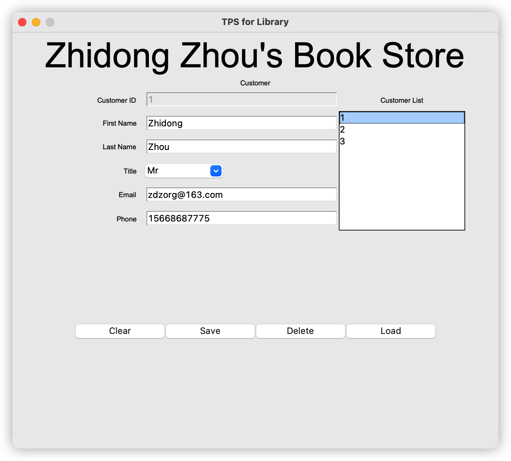

# 书店TPS
书店交易处理系统 (Transaction Processing System), 为帮助书店管理客户信息, 图书信息, 客户购买purchase(或租赁borrow)图书的交易订单信息。

## 业务流程建模
Business Process Modelling: 用户购买图书, 每条订单明确以下内容: 书籍名称和购买书籍的数量，例如：

```
{
    购买者ID: "customer_001", 
    购买图书ID: "book_018", 
    购买数量: 2, 
    图书价格: 15.00
} 
```


## 实体关系图

Entity Relationship Diagram (ERD)
<p align="center"></p>

## 数据库结构

<p align="center"></p>


## Mockup

|   <p align="center"></p>    |   <p align="center"></p>    |
|  ---  |  ---  |
|  <p align="center"></p>     |  <p align="center"></p>     |


## 实现

* 语言: `python`
* python库: 
  * 数据库: `sqlalchemy`
  * GUI: `tkinter`
  * 数据分析: `matplotlib`
* 实现: 
  * 创建sqlite数据库
    * 建表
    * 填充测试数据
  * 数据访问对象 Data Access Object (DAO)
    * 测试: DAO
  * 增加输入验证 Input Validation 测试
  * GUI用户界面:
    * 用户, 产品, 订单数据DAO各一页, 对应CRAD操作Button
    * 数据分析报表生成界面

## 运行

1. 创建数据库: `python create_tables.py`
   1. 用'**DB Browser For SQLite**' 查看数据库
   2. 安装: `brew install db-browser-for-sqlite`
2. 填充测试数据:
   1. 填充测试用户&图书: `python populate_tables.py`
   2. 填充订单数据: `python populate_borrow.py`
3. CRUD测试: 
   1. 用户CRUD测试: `python customer_dao_test.py`
   2. 图书CRUD测试: `python book_dao_test.py`
   3. 订单CRUD测试: `python borrow_dao_test.py`
4. Input Validation: `python validation_test.py`
5. 启动图形用户界面: `python main_gui.py`


## 展示

#### DAO

|   用户    |   图书    |   订单    |
|  ---  |  ---  |  ---  |
|   <p align="center"></p>    |   <p align="center"></p>    |   <p align="center"></p>    |

#### 简易数分报告

|   Cate & Price Pie    |   Stock Bar    |   Stock Pie    |
|  ---  |  ---  |  ---  |
|   <p align="center"></p>    |       <p align="center"></p> |   <p align="center"></p>    |

#### DEMO视频

[](https://www.ixigua.com/7036676531942326821)


## Future Work
- 增加中文格式 Input Validation 
- 改进数据分析报告 (需要更有价值的数分报告， 删除无用报告)
